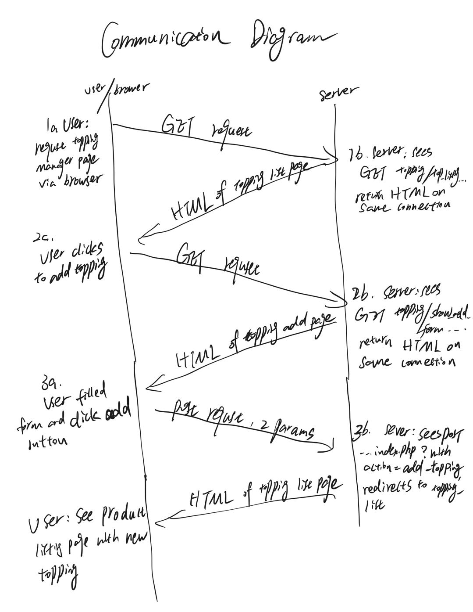

---
export_on_save:
  html: true
---
### CS637
### Assignment 3
### Prof. Betty O'Neil
### Yiwei Yao
---
#### 1. 
* The URL I used to display: http://topcat.cs.umb.edu/cs637/yiweiyao/hello.html
---
#### 2. Page flows:

---
#### 3. Communications Diagram:

---
#### 4. 
  * a:
    * Customers.shipAddressID is a foreign key of addresses.addressID
    * Customers.billingAddressID is a foreign key of addresses.addressID
    * addresses.customerID is a foreign key of customers.customerID
    * orders.customerID is a foreign key of customers.customerID
    * orders.shipAddressID is a foreign key of addresses.addressID
    * orders.billingAddressID is a foreign key of addresses.addressID
    * orderItems.orderID is a foreign key of orders.orderID
    * orderItems.productID is a foreign key of products.productID
    * products.categoryID is a foreign key of categories.categoryID
  * b:
    * orders and orderItems: N-1(orderItems side is the "many" side, and orderItems.orderID expresses the relationship.)
    * orders and customers : N-1(orders side is the "many" side, and orders.customerID expresses the relationship.)
    * orders and products: N-N
    * products and categories: N-1(products side is the "many" side, and products.categoryID expresses the relationship.)
    * customers and addresses: N-1(addresses side is the "many" side, and addresses.customerID expresses the relationship.)
---
#### 5. 
  * a: query: ```SELECT `customerID` FROM `customers` WHERE `emailAddress` LIKE '%@gmail.com';``` <br> 
    Results: 
    |customerID|
    |---|
    |2|
  * b. query: ```SELECT * FROM `orderitems` WHERE `orderID` = 2;```
    Results: 
    |itemID|orderID|productID|itemPrice|discountAmount|quantity|
    |---|---|---|---|---|---|
    |2|2|4|699.00|69.90|1|
  * c. query: ```SELECT orders.orderID, orders.orderDate FROM orders INNER JOIN customers ON orders.customerID = customers.customerID WHERE customers.emailAddress = 'christineb@solarone.com';```
    No result.
  * d. query: ```SELECT orderitems.productID FROM orderitems INNER JOIN orders ON orderitems.orderID = orders.orderID INNER JOIN customers ON customers.customerID = orders.customerID WHERE customers.emailAddress = 'barryz@gmail.com';```
    No result.
  * e. query: ```SELECT DISTINCT products.productID FROM products INNER JOIN orderitems ON orderitems.productID = products.productID INNER JOIN orders ON orders.orderID = orderitems.orderID WHERE orders.orderDate > products.dateAdded;```
    Results:
    |productID|
    |---|
    |2|
    |4|
    |3|
  * f. query: ```SELECT products.productID, products.categoryID, products.productCode, products.productName, products.description, products.listPrice,products.discountPercent, products.dateAdded FROM products INNER JOIN orderitems ON orderitems.productID=products.productID GROUP BY products.productID ORDER BY COUNT(*) DESC LIMIT 1；``` 
    Results:
    |productID|categoryID|productCode|productName|description|listPrice|discountPercent|dateAdded|
    |---|---|---|---|---|---|---|---|
    |2|1|les_paul|Gibson Les Paul|This Les Paul guitar offers a carved top and humbu...|1199.00|30.00|2013-12-05 16:33:13|	
---
#### 6. 
  * a. Redisplay the hoem page: 
  * b. The resulting output of showdb.sql:
    ```
    MariaDB [pizzadb]> source showdb.sql
    +---------------+
    | menu_toppings |
    +---------------+
    | menu_toppings |
    +---------------+
    1 row in set (0.000 sec)

    +----+-----------+---------+
    | id | topping   | is_meat |
    +----+-----------+---------+
    |  1 | Pepperoni |       1 |
    |  2 | Onions    |       0 |
    +----+-----------+---------+
    2 rows in set (0.012 sec)

    +------------+
    | menu_sizes |
    +------------+
    | menu_sizes |
    +------------+
    1 row in set (0.001 sec)

    +----+-------+----------+
    | id | size  | diameter |
    +----+-------+----------+
    |  1 | Small |       12 |
    |  2 | Large |       16 |
    +----+-------+----------+
    2 rows in set (0.008 sec)

    +------------+
    | shop_users |
    +------------+
    | shop_users |
    +------------+
    1 row in set (0.000 sec)

    +----+----------+------+
    | id | username | room |
    +----+----------+------+
    |  1 | joe      |    6 |
    |  2 | sue      |    3 |
    +----+----------+------+
    2 rows in set (0.006 sec)

    +--------------+
    | pizza_orders |
    +--------------+
    | pizza_orders |
    +--------------+
    1 row in set (0.000 sec)

    Empty set (0.002 sec)

    +---------------+
    | order_topping |
    +---------------+
    | order_topping |
    +---------------+
    1 row in set (0.000 sec)

    Empty set (0.002 sec)

    +---------------+
    | status_values |
    +---------------+
    | status_values |
    +---------------+
    1 row in set (0.000 sec)

    +--------------+
    | status_value |
    +--------------+
    | Baked        |
    | Finished     |
    | Preparing    |
    +--------------+
    3 rows in set (0.003 sec)

    +---------------+
    | pizza_sys_tab |
    +---------------+
    | pizza_sys_tab |
    +---------------+
    1 row in set (0.000 sec)

    +-------------+
    | current_day |
    +-------------+
    |           1 |
    +-------------+
    1 row in set (0.003 sec)

    MariaDB [pizzadb]> 
    ```
  * c. Success.
  * d. success.
